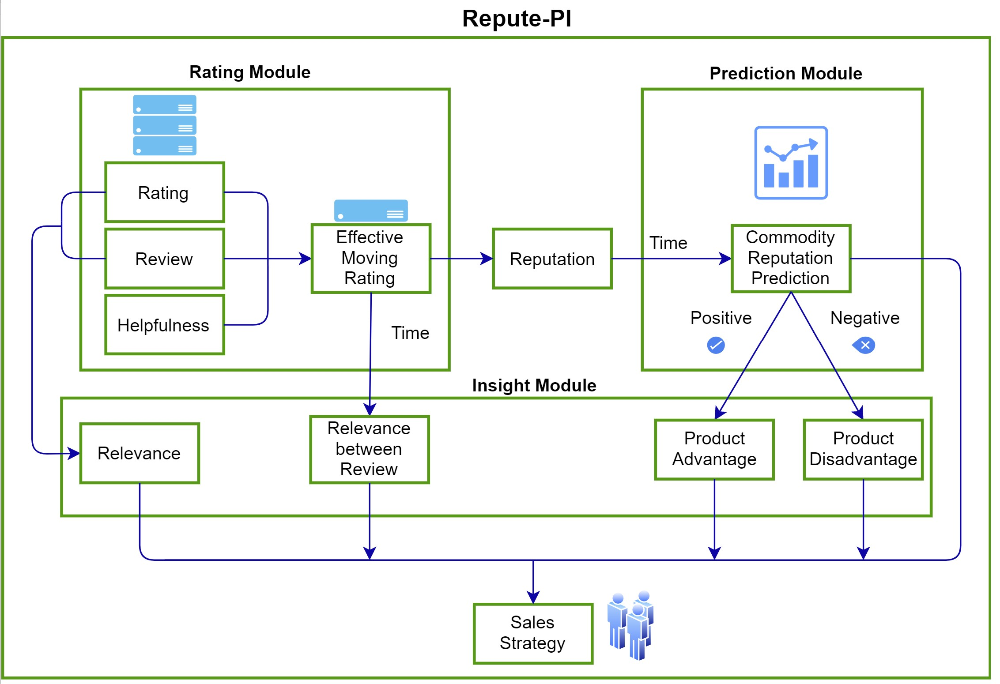
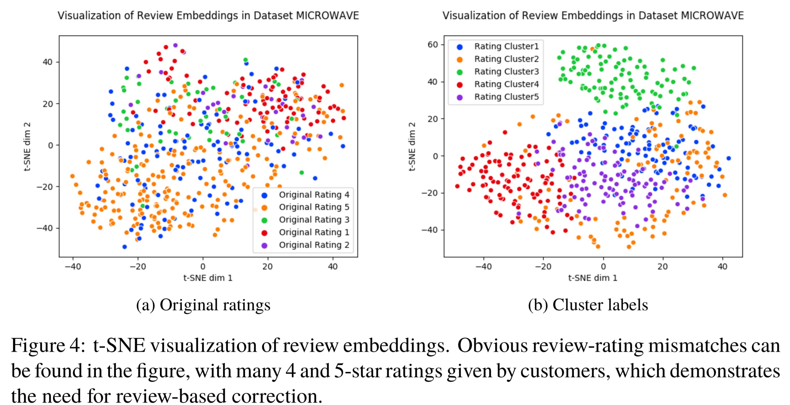
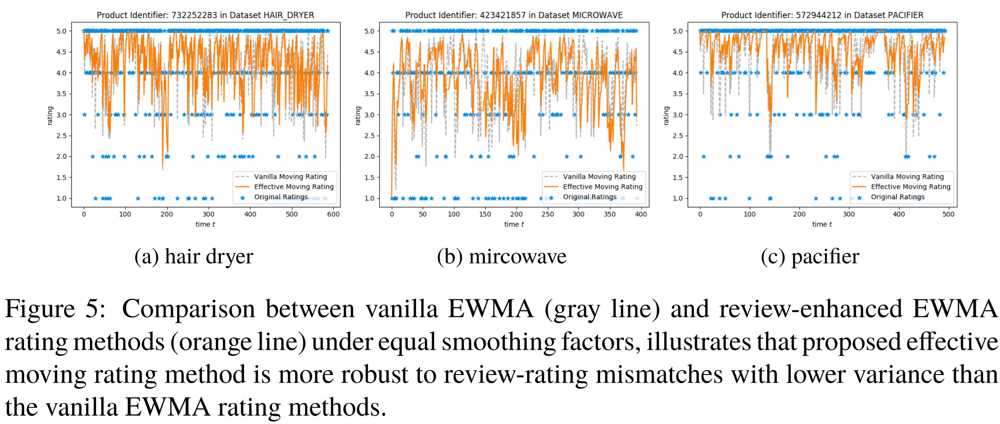
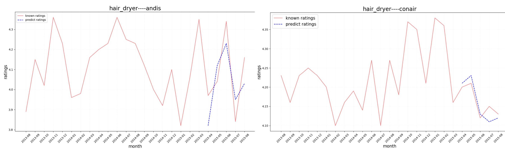
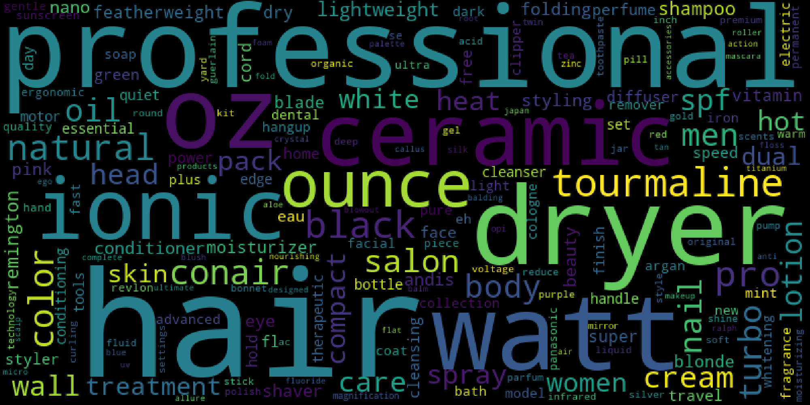

# Repute-PI: An Unsupervised Framework for Online Reputation Monitor and Prediction with Review Information and Rating Dynamics

## Run the model
To kick it off, change the phase to [1,2,3,4] in main.py, then

    python main.py

## Results

+ **Rating Module** - mitigate review-rating mismatches.
  + Review Embedding and Clustering. 

+ + Effective Moving Rating with Review Correction

+ **Prediction Module** - Reputation Prediction based on ARIMA

+ **Insight Module** - What customers care about most 

